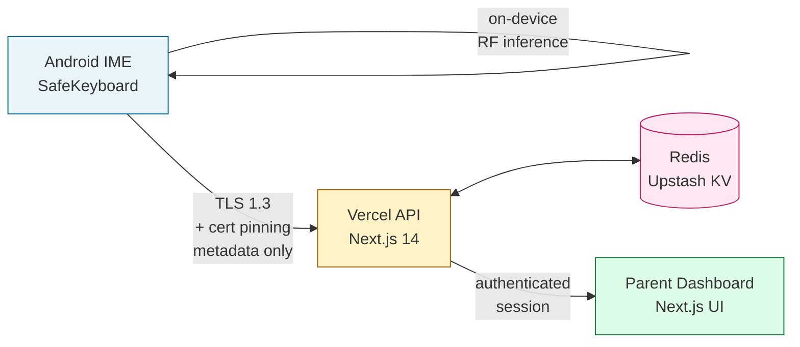

# SendWise

> **Privacy-Preserving Parental Awareness of Adolescent Cyberbullying Risk**

[](https://github.com/NamrataG7/SendWise/actions/workflows/build-apk.yml)
[](https://opensource.org/licenses/MIT)
[](https://nodejs.org/)
[](https://kotlinlang.org/)

---

## Paper

**Title:** *SendWise: Privacy-Preserving Parental Awareness of Adolescent Cyberbullying Risk through On-Device Pre-Send Intervention*

**DOI:** `10.XXXX/XXXXXXX` *(placeholder — to be assigned on acceptance)*

If you use SendWise in academic work, please [cite the paper](#citation).

---

## Architecture



**Data flow guarantee:** message *content* stays on the device. Only anonymised violation metadata (category, severity, timestamp, salted user hash) crosses the network.

---

## Components

### Mobile App — [`SafeKeyboardApp/`](SafeKeyboardApp/)
Android IME (Input Method Editor) with an on-device Random Forest classifier that intercepts risky messages *before* Send is pressed.
- Kotlin 1.9, Android SDK 26–34
- Build via **GitHub Actions** (no local Android Studio required) — see [`BUILD_APK.md`](BUILD_APK.md)
- Install on device — see [`INSTALL_ON_REDMI.md`](INSTALL_ON_REDMI.md)

### Parental Dashboard — [`parental-dashboard/`](parental-dashboard/)
Next.js 14 web dashboard for parents; shows anonymised risk trends per paired device.
- Next.js 14 (App Router), NextAuth, Tailwind
- Deploys to **Vercel** free tier — see [`VERCEL_DEPLOY.md`](VERCEL_DEPLOY.md)

### Model Training — [`model_training/`](model_training/)
Python pipeline that trains the Random Forest classifier shipped inside the APK.
- Python 3.12.7 + scikit-learn 1.5.2
- Reproduces paper metrics — see [`model_training/MODEL_TRAINING.md`](model_training/MODEL_TRAINING.md)

---

## Reproducibility

Metrics reported in the paper (Random Forest, `sendwise_dataset.csv`, 20,122 rows, 80/20 stratified split):

| Metric | Value |
| --- | --- |
| Precision | **85.96** |
| Recall | **95.73** |
| F1 | **90.58** |

Retraining is deterministic (fixed `random_state=42`); see [`model_training/MODEL_TRAINING.md`](model_training/MODEL_TRAINING.md) for the exact environment and command.

---

## Privacy Guarantees

> [!IMPORTANT]
> **Message content never leaves the device.** The on-device classifier runs in the IME process; only anonymised metadata is transmitted.

- ✅ Inference is fully on-device (Random Forest in `assets/models/sendwise_rf_v1.json.gz`)
- ✅ Network payload contains only: `{salted_user_hash, category, severity, action, timestamp}`
- ✅ TLS 1.3 with certificate pinning between IME and API
- ✅ User identifier is `SHA-256(AndroidID ‖ AppSalt)` — one-way, non-reversible
- ✅ No message text, no recipient identity, no cross-platform tracking
- ✅ Parent dashboard shows aggregate counts, never message excerpts

---

## Quick Links

| Task | Document |
| --- | --- |
| Deploy dashboard to Vercel | [`VERCEL_DEPLOY.md`](VERCEL_DEPLOY.md) |
| Get the APK (no local build) | [`BUILD_APK.md`](BUILD_APK.md) |
| Install on a Redmi Note 7 Pro | [`INSTALL_ON_REDMI.md`](INSTALL_ON_REDMI.md) |
| Retrain the classifier | [`model_training/MODEL_TRAINING.md`](model_training/MODEL_TRAINING.md) |

---

## License

Released under the [MIT License](https://opensource.org/licenses/MIT).

## Citation

```bibtex
@article{ganesan2026sendwise,
  title   = {SendWise: Privacy-Preserving Parental Awareness of Adolescent
             Cyberbullying Risk through On-Device Pre-Send Intervention},
  author  = {Ganesan, Namrata and collaborators},
  journal = {(under review)},
  year    = {2026},
  doi     = {10.XXXX/XXXXXXX}
}
```

## Authors

- **Namrata Ganesan** — principal investigator, system design, model training
- Collaborators listed in the paper

---

<sub>Built with privacy, ethics, and user empowerment at the core.</sub>
