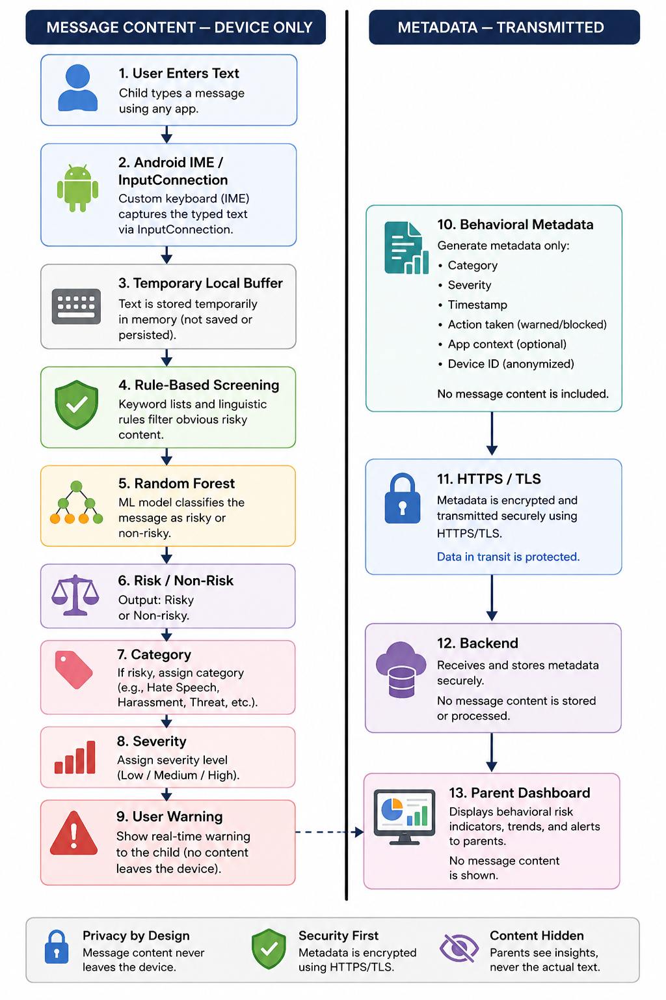

# SendWise

**Privacy-first parental awareness for online adolescent safety.**

[](https://github.com/NamrataG7/SendWise/actions/workflows/build-apk.yml)


SendWise is a three-tier system that helps parents stay aware of online cyberbullying risk **without ever seeing message content**:

- **Tier 1 — Android Keyboard (IME)** analyzes outgoing text on-device.
- **Tier 2 — Backend** (Vercel + Redis) accepts only behavioral metadata.
- **Tier 3 — Parental Dashboard** (Next.js + Supabase) shows aggregated risk indicators.

**Live dashboard:** https://sendwise-lac.vercel.app
**APK downloads:** https://github.com/NamrataG7/SendWise/actions (latest run → Artifacts → `SendWise-debug-apk`)

---

## Table of Contents

1. [How It Works](#how-it-works)
2. [Installation](#installation)
3. [Setup on Android](#setup-on-android)
4. [Grant Overlay Permission (Required)](#grant-overlay-permission-required)
5. [Pair with Parent Dashboard](#pair-with-parent-dashboard)
6. [Using SendWise Day-to-Day](#using-sendwise-day-to-day)
7. [Parent Dashboard Features](#parent-dashboard-features)
8. [Privacy Guarantees](#privacy-guarantees)
9. [Development](#development)
10. [License](#license)

---

## How It Works



1. Child types on the SendWise keyboard in any messaging app.
2. Text is buffered in RAM (≤500 chars) and analyzed on-device by a hybrid detector (Random Forest classifier + hardcoded slur triggers + lexicon fallback).
3. When risk is detected, a full-screen **warning overlay** appears with two choices: **Edit Message** or **Continue**.
4. Only behavioral metadata — category, severity, action taken, timestamp, anonymous user hash — is sent to the backend over TLS 1.3.
5. Parents log in to the web dashboard to see aggregate incident trends. **No message content ever leaves the child's device.**

**Risk categories:**

| Category | Examples |
|---|---|
| Harassment | insults, name-calling, personal attacks |
| Threats | violent language directed at a person |
| Hate speech | slurs targeting protected groups |
| Sexual content | unwanted sexual language, coercion |
| Self-harm risk | suicidal ideation, self-injury |

**Severity levels:** high · medium · low

---

## Installation

### Step 1 — Parent creates an account

1. Open **https://sendwise-lac.vercel.app** in any browser.
2. Click **"Create one"** under the login form.
3. Sign up with your email + password.
4. (If email confirmation is enabled on Supabase) click the confirmation link in your inbox.
5. You now see the empty dashboard: **"No devices linked yet"**.

### Step 2 — Download the APK for the child device

1. Go to **https://github.com/NamrataG7/SendWise/actions**.
2. Click the most recent green ✅ **Build APK** run.
3. Scroll to the bottom → **Artifacts** section → download **`SendWise-debug-apk`** (a `.zip`).
4. Unzip to obtain `app-debug.apk`.
5. Transfer to the child's Android phone by email, Google Drive, USB, or `adb install`.

---

## Setup on Android

Tested on **Redmi Note 7 Pro (MIUI 12 / Android 10)**. Steps are similar for most Android phones.

### Step 3 — Install the APK

1. On the child device, tap the transferred `app-debug.apk` file.
2. If prompted **"Install from unknown sources"** — enable it for your file manager or browser.
3. On MIUI you may see **"This app was built for an older version of Android"** — tap **Install Anyway**.
4. After install, find **SendWiseKeyboard** in the app drawer and open it once (this initializes settings).

### Step 4 — Enable SendWiseKeyboard as your keyboard

1. Go to **Settings → Additional Settings → Languages & Input → Manage Keyboards**.
2. Toggle **SendWiseKeyboard** to **on**.
3. Android will show a security warning — this is normal for any IME.
4. Now open the notification shade → tap the **keyboard picker** icon → select **SendWiseKeyboard**.
5. Open any messenger (WhatsApp, SMS, Instagram DM, etc.) — the SendWise keyboard should appear.

---

## Grant Overlay Permission (Required)

**This step is critical.** Without overlay permission, the pre-send warning popup cannot appear over other apps.

### On MIUI / Xiaomi

1. Open **Settings → Apps → SendWiseKeyboard → Other permissions**.
2. Enable **"Display pop-up windows while running in background"**.
3. Enable **"Display pop-up window"**.
4. Enable **"Draw over other apps"**.

### On stock Android

1. Open **Settings → Apps → SendWiseKeyboard → Advanced → Display over other apps**.
2. Toggle **Allow display over other apps** to **on**.

### On Samsung One UI

1. Open **Settings → Apps → SendWiseKeyboard → Appear on top**.
2. Toggle **Allow permission** to **on**.

If the warning still doesn't appear as a full-screen popup after granting these, SendWise falls back to a toast + suggestion-strip banner so the child is still warned.

---

## Pair with Parent Dashboard

### Step 5 — Generate a 6-digit code on the child device

1. Open the **SendWiseKeyboard** app icon from the app drawer.
2. Tap **Settings → Parental Link**.
3. Tap **"Generate Pairing Code"**.
4. A large **6-digit code** appears (e.g. `847293`) with a **15-minute countdown**.

### Step 6 — Enter the code on the parent dashboard

1. On the parent device, log in to **https://sendwise-lac.vercel.app**.
2. Click **"Link a Child Device"** (or go to `/pair`).
3. Enter the 6-digit code from the child device.
4. (Optional) type a name for the child device.
5. Click **Submit**.
6. ✅ Dashboard shows **"1 device linked"**. From now on, every incident on the child device streams here.

---

## Using SendWise Day-to-Day

### On the child device

- Type normally in any messenger. SendWise autocompletes and behaves like a regular keyboard.
- When risky language is detected before send:
  - A **suggestion-strip banner** turns red with the category and severity.
  - A **full-screen warning popup** appears (if overlay permission is granted).
  - The child taps **Edit Message** (revise) or **Continue** (send anyway).
- Both choices are logged to the parent dashboard.

### On the parent dashboard

- **Home page** → incident feed with per-message cards, category filters, critical alerts banner, and CSV export.
- **View Insights** → 4-chart aggregated view: 30-day trend, category distribution, severity donut, edited-vs-sent ratio.
- **Unlink Device** → detach a linked child at any time. Also wipes their incident history.
- **Sign out** → top-right corner.

---

## Parent Dashboard Features

| Feature | Description |
|---|---|
| Multi-parent auth | Supabase-backed sign-up and login |
| Multi-child pairing | Link multiple child devices per parent account |
| Live incident feed | Real-time updates from child's SendWiseKeyboard |
| Category filters | Filter by harassment, threats, hate speech, sexual content, self-harm |
| Critical alerts banner | Prominent alert for high-severity incidents |
| Redacted content view | Displays "Message content is private" — no text ever shown |
| CSV export | Metadata-only report for record-keeping |
| Behavioral insights | 30-day trend, category distribution, severity breakdown, action ratio |
| Unlink device | One-click detach + history wipe |
| Sign out | Standard Supabase session termination |

---

## Privacy Guarantees

Enforced at every layer:

| Layer | Enforcement |
|---|---|
| Android buffer | 500-char RAM buffer, cleared after inference |
| Sensitive fields | Skipped entirely — passwords, PINs, email/URI fields, banking/UPI apps |
| Network payload | Never includes text/message/content fields |
| Server ingest | `/api/violations` rejects any payload with `text`, `message`, or `content` fields |
| Server storage | Only metadata: `user_id_hash`, `timestamp`, `category`, `severity`, `action`, `session_id` |
| Dashboard UI | Renders only metadata + shield-icon redaction notice |
| Transport | HTTPS + TLS 1.3 preferred (TLS 1.2 fallback) |
| Identity | `user_id_hash = SHA-256(Android_ID + per-device Keystore-backed random salt)` |

---

## Development

### Requirements

- Android Studio Ladybug (2024.2.1) or later, or GitHub Actions builds
- JDK 21
- Android SDK API 34
- Node.js 20+ for dashboard development
- Python 3.12 + scikit-learn 1.5 for model training

### Local setup

```bash
git clone https://github.com/NamrataG7/SendWise.git
cd SendWise

# Dashboard
cd parental-dashboard
npm install
cp .env.example .env.local  # fill in Supabase + Redis credentials
npm run dev                 # http://localhost:3000

# Android
cd ../SafeKeyboardApp
./gradlew assembleDebug     # apk output: app/build/outputs/apk/debug/app-debug.apk
```

### Repository structure

```
SendWise/
├── SafeKeyboardApp/          # Android IME (Kotlin)
├── parental-dashboard/       # Next.js 14 web app
├── model_training/           # Python trainer + dataset
├── shared/detection-library/ # Auxiliary JS detectors
├── docs/                     # Diagrams & assets
├── .github/workflows/        # APK build CI
├── README.md
├── CONTRIBUTING.md
├── SECURITY.md
└── LICENSE
```

---

## License

MIT. See [LICENSE](./LICENSE).
